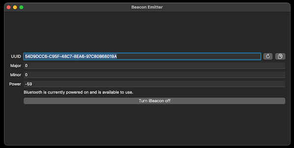

BeaconEmitter
=============
[Public TestFlight beta](https://testflight.apple.com/join/EQ8fncz5)

Beacon Emitter is a macOS app that turns your Mac device into an iBeacon emitter. With this app, you can easily create and configure a beacon that broadcasts its presence to nearby devices equipped with Bluetooth Low Energy (BLE) technology.
