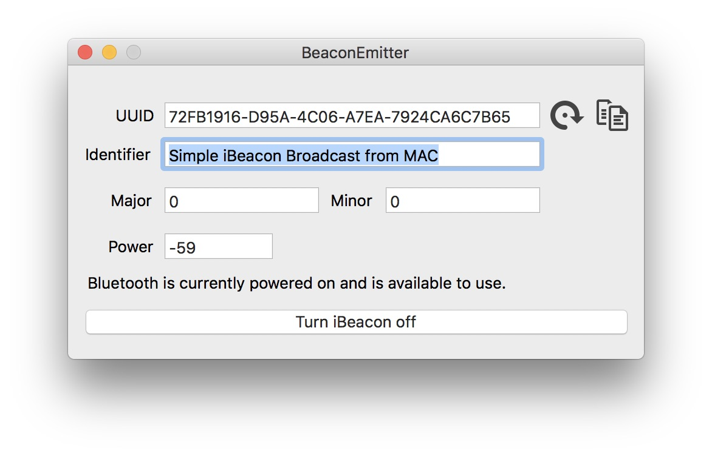

BeaconEmitter
=============

Turn your Mac as an iBeacon.

  

Read this [blog post](http://www.blendedcocoa.com/blog/2013/11/02/mavericks-as-an-ibeacon/) from [Matthew Robinson](https://github.com/mttrb) for more explanation.